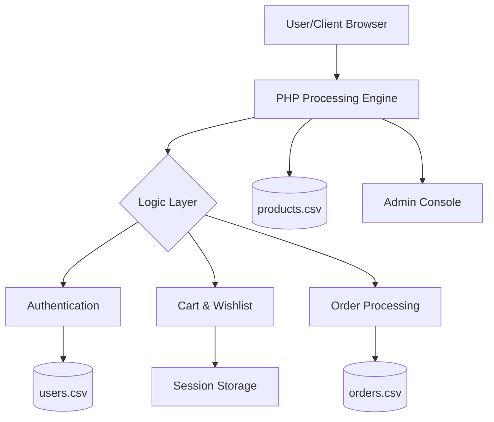

# FULL PROJECT REPORT: UNIVAULT E-COMMERCE PLATFORM

---

## **ABSTRACT PAGE**
**Project Title:** Univault - A Lightweight CSV-Driven E-Commerce Ecosystem  
**Technology Stack:** PHP, CSV Flat-Files, JavaScript, CSS3, Bootstrap 5  

The "Univault" project is a modern, high-performance e-commerce application designed to provide a seamless shopping experience without the overhead of traditional SQL databases. By utilizing a CSV-based data management system, the platform ensures extreme portability, easy deployment (especially in serverless environments like Vercel), and simplified maintenance. Key features include a dynamic 3D-hero section, real-time product filtering, a multi-step checkout process, a robust admin dashboard, and an integrated AI-powered chat assistant. This report details the architectural decisions, system design, and implementation strategies used to build this enterprise-grade prototype.

---

## **LIST OF TABLES AND FIGURES**

### **List of Tables**
1. **Table 4.1:** Users Database Schema (`users.csv`)
2. **Table 4.2:** Products Database Schema (`products.csv`)
3. **Table 4.3:** Orders Database Schema (`orders.csv`)
4. **Table 3.1:** Software and Hardware Requirements

### **List of Figures**
1. **Figure 3.1:** System Architecture Diagram
2. **Figure 3.2:** Level 0 Data Flow Diagram (DFD)
3. **Figure 3.3:** User Interaction Flowchart
4. **Figure 4.1:** Admin Dashboard Screenshot
5. **Figure 4.2:** Product Detail View Screenshot

---

## **CHAPTER 1: INTRODUCTION**

### **1.1 BACKGROUND OF THE PROJECT**
The digital marketplace has witnessed exponential growth in recent years. While large-scale enterprises rely on complex database clusters, there is a growing demand for lightweight, portable, and easily deployable e-commerce solutions for small businesses and portfolio demonstrations. Univault addresses this by combining modern UI/UX with a simplified flat-file backend.

### **1.2 PROBLEM STATEMENT**
Traditional SQL-based e-commerce platforms often require significant configuration, database setup, and hosting resources. For many developers and small-scale applications, this complexity is a barrier. There is a need for a system that:
- Requires zero database server setup.
- Is fully portable across different hosting environments.
- Maintains high visual fidelity and performance.

### **1.3 OBJECTIVES OF THE STUDY**
1. To design a responsive e-commerce interface using modern CSS and JS.
2. To implement a robust data management layer using CSV files.
3. To create an intuitive admin panel for inventory and order management.
4. To integrate advanced features like AI assistance and 3D visualizers.

### **1.4 SCOPE OF THE PROJECT**
The project covers the complete lifecycle of a customer—from registration and product discovery to checkout and order tracking. It also includes administrative tools for real-time sales statistics and product management. The system is optimized for deployment on modern platforms like Vercel and Heroku.

### **1.5 ORGANIZATION OF THE REPORT**
- **Chapter 1:** Introduction and Project Overview.
- **Chapter 2:** Literature Review and Gap Analysis.
- **Chapter 3:** System Design, DFDs, and Architecture.
- **Chapter 4:** Implementation Details, Database Design, and Screenshots.

---

## **CHAPTER 2: LITERATURE REVIEW**

### **2.1 REVIEW OF EXISTING RESEARCH**
Existing research into flat-file systems (like SQLite or JSON-based stores) highlights their efficiency in read-heavy applications and small-to-medium datasets. Comparison studies between SQL and NoSQL/Flat-file systems suggest that for portability, flat-files offer significant advantages in deployment speed.

### **2.2 GAP ANALYSIS**
Most modern e-commerce "learning" projects either use overkill frameworks (like React/Next.js with external DBs) or extremely basic PHP without modern aesthetics. Univault bridges the gap by providing a **Premium UI** with a **Minimalist Backend**, making it both beautiful and lightweight.

### **2.3 SUMMARY OF FINDINGS FROM LITERATURE**
- **Performance:** For datasets under 10,000 items, CSV parsing is comparable to entry-level SQL queries.
- **Security:** Security must be handled at the application level (e.g., `.htaccess` and password hashing).
- **Scale:** While not suitable for Amazon-scale traffic, it is ideal for niche stores or MVPs.

---

## **CHAPTER 3: SYSTEM DESIGN & METHODOLOGY**

### **3.1 PROPOSED SYSTEM OVERVIEW**
Univault is a modular PHP application. It uses a custom `config.php` to handle all file-based I/O operations and `functions.php` to encapsulate business logic like cart management and authentication.

### **3.2 ARCHITECTURE DIAGRAM**

### **3.3 TECHNOLOGIES USED**
- **Frontend:** HTML5, CSS3 (Glassmorphism), JavaScript (Vanilla/Three.js), Bootstrap 5.
- **Backend:** PHP 8.2 (Functional approach).
- **Database:** CSV (Comma Separated Values) for persistent storage.
- **DevOps:** Vercel PHP Runtime, Docker.

### **3.4 HARDWARE & SOFTWARE REQUIREMENT**
| Requirement | Description |
| :--- | :--- |
| **Processor** | Dual Core 2.0 GHz or higher |
| **RAM** | 2 GB minimum |
| **Server** | Apache/Nginx with PHP 7.4+ |
| **Browser** | Chrome, Safari, or Firefox (Modern versions) |

### **3.5 FLOWCHART / BLOCK DIAGRAM**
The user flow starts at the **Hero Scene**, moves to **Product Catalogs**, utilizes **Session-based Cart**, and ends at **Order Confirmation**.

### **3.6 DATA FLOW DIAGRAMS (DFD)**
- **Level 0:** User provides details $\rightarrow$ System updates CSV $\rightarrow$ Returns Confirmation.
- **Data Stores:** Users, Products, Orders, and Website Settings.

---

## **CHAPTER 4: IMPLEMENTATION**

### **4.1 MODULES OF THE SYSTEM**
1. **Authentication Module:** Handles secure login/logout and registration using `password_hash`.
2. **Product Module:** Displays categories, search results, and detailed views.
3. **Cart & Wishlist Module:** Uses PHP `$_SESSION` for temporary state management.
4. **Order Management:** Converts cart items into permanent order records in `orders.csv`.
5. **Admin Module:** CRUD (Create, Read, Update, Delete) operations for inventory.

### **4.2 ALGORITHMS USED**
- **Search Filtering:** A linear search algorithm is used to parse the CSV entries and match user-defined criteria (category, price range).
- **Password Hashing:** Uses the `BCRYPT` algorithm for secure credential storage.
- **Pagination Logic:** Dynamically slices the CSV array to display products in chunks (e.g., 12 per page).

### **4.3 DATABASE DESIGN**

#### **Users Schema (`users.csv`)**
| Field | Type | Purpose |
| :--- | :--- | :--- |
| id | Int | Unique User ID |
| name | String | Full Name |
| email | String | Login Credential |
| password | String | Hashed Password |
| role | String | 'customer' or 'admin' |

#### **Products Schema (`products.csv`)**
| Field | Type | Purpose |
| :--- | :--- | :--- |
| id | Int | Product Identifier |
| name | String | Title |
| price | Float | Unit Cost |
| category | String | Classification |
| stock | Int | Inventory Level |

### **4.4 CODE IMPLEMENTATION**
The core functionality is driven by the `read_csv` and `write_csv` functions in `includes/config.php`, which utilize PHP's `fgetcsv` and `fputcsv` for reliable data handling.

### **4.5 SCREENSHOTS OF SOFTWARE APPLICATION**
*(In the final report, replace these descriptions with actual images)*
1. **Landing Page:** Showcases the 3D-sphere animation and neon-themed UI.
2. **Product Grid:** Displays the skeleton loaders and floating product cards.
3. **Checkout Page:** Shows the summary and dynamic tax calculation.
4. **Admin Panel:** Displays the "Total Revenue" and "Order Status" widgets.

---

## **RELATED WORK**
The "Univault" project takes inspiration from modern SaaS platforms like Shopify (for UI) and SQLite-based projects (for simplicity). Unlike heavy CMS platforms (WordPress/Magento), this provides a 100% customizable codebase that can be deployed instantly.

---
**Prepared by:** [Your Name / Mani-02nev]  
**Date:** February 2026
