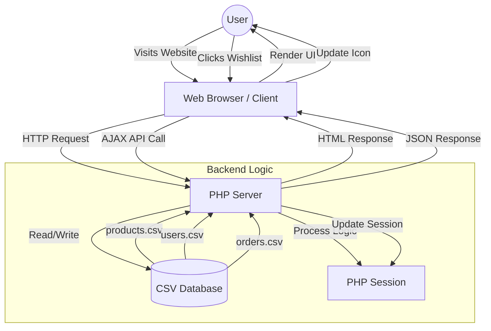

# Final Project Report: Univault E-commerce System

## 1. Project Overview
**Univault** is a fully functional, lightweight e-commerce platform built effectively using **PHP** and **CSV-based data storage**. The project demonstrates a complete online shopping experience, ranging from product browsing to secure checkout, without requiring a complex SQL database setup. It focuses on performance, simplicity, and a modern user interface.

## 2. System Architecture & Workflow

The system follows a standard **Client-Server** architecture where the PHP backend processes requests, interacts with the file-based database (CSV files), and serves dynamic HTML content to the client.

### Workflow Diagram



### Workflow Explanation

1.  **Request Handling**: When a user accesses a page (e.g., `index.php`), the PHP server intercepts the request.
2.  **Data Retrieval**: The application uses custom helper functions (`read_csv`) in `includes/functions.php` to fetch data from `data/products.csv`.
3.  **Session Management**: User specific data (Cart items, Wishlist, Login status) is managed using PHP Sessions (`$_SESSION`), ensuring data persists as the user navigates different pages.
4.  **Rendering**: The server processes this data and merges it with HTML templates (`header.php`, `footer.php`) to produce the final webpage sent to the user.
5.  **Data Persistence**: When a user registers or places an order, the system writes the new data securely back to `users.csv` or `orders.csv` using file locking mechanisms (`flock`) implicitly handled by file operations to ensure data integrity.

## 3. Technology Stack & Tools Used

### Frontend (Client-Side)
*   **HTML5**: Semantic structure for accessibility and SEO.
*   **CSS3**: Custom styling with a focus on responsiveness and modern aesthetics (Flexbox/Grid).
    *   *Note:* Responsive design ensures the site works on mobile (320px+) and desktop.
*   **JavaScript (Vanilla)**: Handles client-side interactivity.
    *   **AJAX (Fetch API)**: Used for seamless operations like "Add to Wishlist" without reloading the page.
    *   **DOM Manipulation**: Dynamic updates to UI elements (e.g., heart icon animation).

### Backend (Server-Side)
*   **PHP (Hypertext Preprocessor)**: The core server-side language.
    *   **Functions**: Modular code structure (`includes/functions.php`) for reusability.
    *   **Sessions**: Secure handling of cart and user authentication states.
*   **File System I/O**: Direct file manipulation for reading and writing database records.

### Database (Storage)
*   **CSV (Comma-Separated Values)**: A flat-file database approach.
    *   `products.csv`: Stores product details (ID, Name, Price, Image, Stock).
    *   `users.csv`: Stores user credentials and profile info.
    *   `orders.csv`: Records transaction details.
    *   *Advantage*: Zero-configuration, easy to portability, and simple to backup.

## 4. Key Functionalities

### 1. Product Catalog
*   **Dynamic Listing**: Products are fetched from `products.csv` and displayed in a grid layout.
*   **Filtering**: Helper functions allow filtering products by category or ID.

### 2. User Authentication
*   **Registration**: Users can create accounts. Passwords should be hashed (using `password_hash`) before storage for security.
*   **Login**: Credentials are verified against `users.csv`. Successful login starts a user session.

### 3. Shopping Cart & Wishlist
*   **Persistent State**: Both cart and wishlist use PHP Sessions. This means a user can add items, close the browser (if session cookie persists), and return to find their items.
*   **Real-time Updates**: The Wishlist feature uses JavaScript to communicate with `api/wishlist_toggle.php`, providing instant visual feedback.

### 4. Checkout System
*   **Order Processing**: When checkout is submitted, `create_order()` compiles the cart data, user info, and total amount.
*   **Record Creation**: A new row is appended to `orders.csv` with a unique Order ID and "Pending" status.
*   **Stock Management**: Automatically decrements product stock in `products.csv` upon successful order.

## 5. Directory Structure
```
/
├── assets/             # Images and static resources
├── css/                # Stylesheets (style.css, responsive.css)
├── data/               # CSV Database files (products.csv, etc.)
├── includes/           # Reusable PHP components
│   ├── config.php      # Global configurations & constants
│   ├── functions.php   # Core logic functions
│   └── header/footer.php # Layout templates
├── js/                 # Javascript files
├── api/                # Backend endpoints for AJAX
├── index.php           # Homepage
├── product-detail.php  # Individual product view
├── cart.php            # Shopping cart page
└── checkout.php        # Order finalization
```

## 6. Conclusion
The **Univault** project is a robust example of a flat-file CMS e-commerce solution. By leveraging the power of PHP's file handling and session management, it delivers a core shopping experience without the overhead of a database server. It is modular, easy to maintain, and readily extensible.
